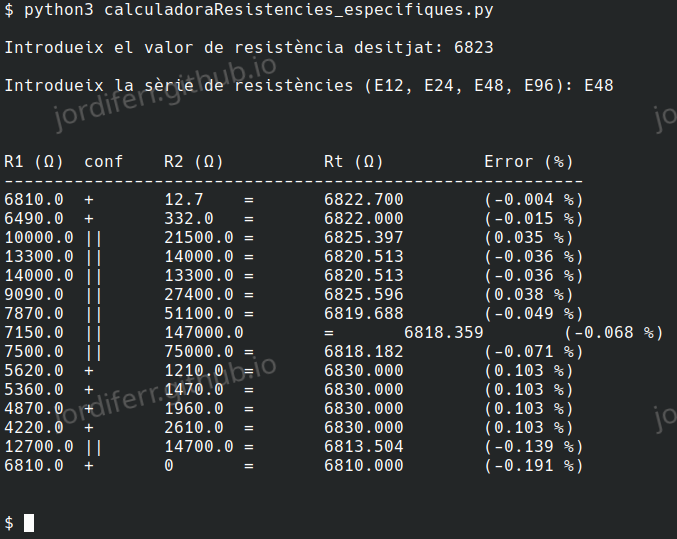

# Python

Recull d'algunes utilitats escrites en Python. Algunes només són poques línies per automatitzar alguna tasca.  
D'altres són scripts per a facilitar algun càlcul, provar alguna llibreria o fins i tot aconseguir trobar una solució d'algun problema amb el que em vaig trobar a la carrera.

## Calculadora resistències (calculadoraResistencies_especifiques.py)

L'objectiu d'aquest programa era solucionar el fet d'haver de calcular les resistències optimes per projecte personal.

Per a que puguis veure a què m'estic referint, aquí tens una imatge. 
 

 
Bàsicament el que es mostra per pantalla és:

| Simbols | Explicació |
| :--- | :--- |
| R1 (Ω) | Resistència 1 en Ohms |
| conf | Configuració de R1 amb R2: Pot ser '+' que indica SÈRIE o '\|\|' que indica PARAL·LEL |
| R2 (Ω) | Resistència 2 en Ohms |
| Rt (Ω) | Resistència total en Ohms |
| Error (%) | Error respecte a la resistència que desitjes |

